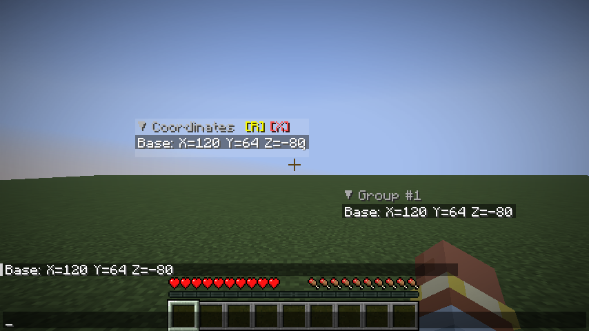

**English** · [Русский](README.ru.md)

# PinChat

**Keep the chat messages you need in sight.**

Pin coordinates, reminders, and messages from friends directly on your Minecraft screen.

[Download](https://github.com/ivanmikhaylov1/pinchat-mod/releases) · [Report a bug](https://github.com/ivanmikhaylov1/pinchat-mod/issues/new/choose)

## Features

- Pin and unpin chat messages with a click.
- Organize messages into independent groups, such as “Base”, “Quests”, and “Trading”.
- Move, resize, rename, and collapse groups.
- Keep messages and group layouts between game sessions.
- Open a special chat mode that lets you move and look around.

PinChat is **client-side**. You do not need to install it on the server. The interface follows your Minecraft language, with English and Russian translations included.

*In-game example: the same message pinned in two independent groups. Captured during the Fabric 1.21.11 client test.*

## Supported versions

| Minecraft | Java | Fabric | Quilt | Forge | NeoForge |
|---|---|---|---|---|---|
| 1.21.11 | 21 | ✓ | ✓ | ✓ (61.x) | ✓ |
| 26.1 / 26.1.1 / 26.1.2 | 25 | ✓ | ✓¹ | — | ✓ |
| 26.2 | 25 | ✓ | ✓¹ | — | ✓ |
| 26.3 | 25 | ✓ | ✓¹ | — | ✓ |

¹ Quilt 26.x uses the same JAR as Fabric. For 26.1.1 and 26.1.2, use the **mc26.1** build or its identically packaged hotfix download. Minecraft 26.2 and 26.3 each need their own **mc26.2** or **mc26.3** build. Support for 26.3 is available starting with PinChat 3.2.0.

This table lists available builds. See [compatibility](docs/COMPATIBILITY.md) for test coverage and limitations.

## Installation

1. Install a supported mod loader for your Minecraft version.
2. Download [PinChat from Releases](https://github.com/ivanmikhaylov1/pinchat-mod/releases). Filenames identify the loader and game version, for example `pinchat-mod-fabric-3.2.0-mc26.1.jar`.
3. Put **one** matching PinChat JAR in your game profile’s `mods` folder.
4. For Fabric and Quilt, also install [Fabric API](https://modrinth.com/mod/fabric-api) **for your exact Minecraft version**.
5. Start the game, open chat, and right-click a message to pin it.

Forge and NeoForge need no additional mods. Cloth Config, YACL, and MaLiLib are not required. ModMenu is optional: on Fabric 1.21.11 it lets you open PinChat settings from the mod list.

If your launcher asks for Java, use Java 21 for 1.21.11 and Java 25 for 26.x. Downloads are available from [Adoptium](https://adoptium.net/temurin/releases/).

## Controls

Mouse controls for groups are available while normal chat is open (`T` or `/`).

| Action | Control |
|---|---|
| Pin / unpin a message | Right-click the message in chat |
| Create a separate group with a message | `Shift` + right-click the message |
| Move a group | Hold the left mouse button on its message and drag |
| Resize a group | Drag `↘` in the bottom-right corner |
| Collapse / expand | Left-click the group header |
| Remove a pinned line | Right-click the line inside its group |
| Rename / delete a group | Hover over the group and click `[R]` / `[X]` |
| Open special chat mode | `F9` |
| Close special chat mode | `F9` again or `Esc` |
| Open settings | `F8` |

Special chat mode keeps movement keys and camera control active and hides the text input. Use normal chat to type messages. `F8` (settings) and `F9` (special chat) are free in the standard Minecraft controls for supported versions. You can rebind either action in Minecraft’s Controls settings, under **PinChat**; keyboard and mouse bindings are supported.

These are the defaults starting with PinChat 3.2.0. Version 3.1.0 used `P` and `U`. Minecraft keeps saved bindings when you update: in an existing profile, change PinChat settings to `F8` and special chat to `F9`, or reset those two actions individually. `P` opens the multiplayer social menu, and `O` opens the friends list in 26.2.

The default limit is **5 messages per group**. Settings, groups, and their positions are saved in your profile’s `config/pinchat.json`. The built-in settings screen toggles special chat mode; other options are available in the configuration file. Close the game and back up the file before editing it manually.

## Troubleshooting

| Problem | What to check |
|---|---|
| The game will not start | Matching game, loader, Java, and JAR versions; Fabric API installed where required |
| PinChat does not appear | The JAR is in the active profile’s `mods` folder; no duplicate PinChat JAR |
| `F8` or `F9` does not work | Key conflicts in Controls; special chat mode enabled |
| Another message will not pin | The group’s message limit; try `Shift` + right-click to create a new group |
| Groups disappear after launch | The same game profile and its `config/pinchat.json` are being used |

Still stuck? [Open an issue](https://github.com/ivanmikhaylov1/pinchat-mod/issues/new/choose) with game and loader versions, reproduction steps, and `logs/latest.log`. Remove personal information from the log before posting it. Reports in English or Russian are welcome.

## For contributors

[Development and architecture](docs/DEVELOPMENT.md) · [In-game testing](docs/TESTING.md) · [Contributing](CONTRIBUTING.md) · [Compatibility](docs/COMPATIBILITY.md) · [Releasing](docs/RELEASING.md)

Documentation is maintained in English and Russian. English is the primary language; each guide links to its Russian counterpart. Releases include both languages on the same page.

Licensed under [MIT](LICENSE).
